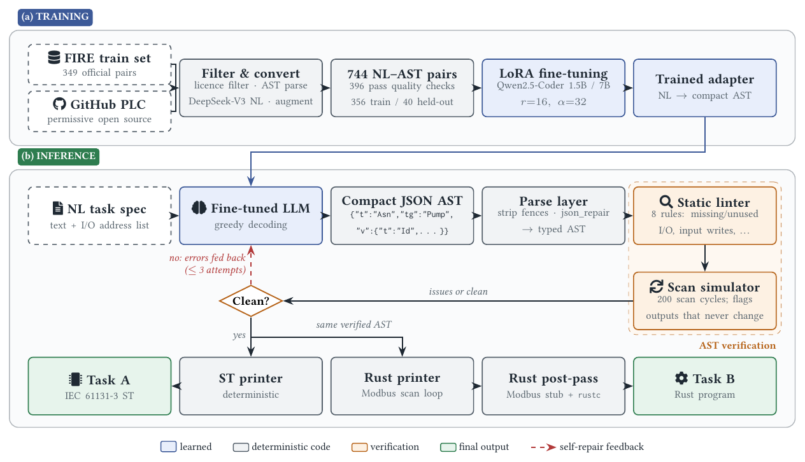

# NL2PLC: natural language to Structured Text and Rust

Team **fih** at the FIRE 2026 shared task *AI4Industrial Automation: NL2PLC Code Generation and Understanding*.

- Task A: natural language → IEC 61131-3 Structured Text (ST)
- Task B: natural language → Rust (Modbus scan loop)

The model never writes ST or Rust. It writes a compact JSON syntax tree, which deterministic code checks and then prints in either language. This repository holds the code and outputs of the three submitted runs, the post-hoc analysis, and the LaTeX source of the working note ([PDF](paper/fih_nl2plc_working_note.pdf)).



## Pipeline

The stages below follow the order of the paper. [docs/PIPELINE.md](docs/PIPELINE.md) gives the details of each stage and the file that implements it.

### 1. Data

The official FIRE training set (349 pairs) was combined with permissively licensed IEC 61131-3 programs from GitHub (MIT, Apache-2.0, BSD, ISC, Unlicense, CC0). Each program was split into units, converted to the tree format, described in natural language by DeepSeek-V3, and augmented by renaming I/O, tags and literals. This produced 744 NL–tree pairs. After quality filtering, 396 remained, split 356 / 40 (train / held-out, seed 42).

The corpus builder and scraper are not part of this repository.

### 2. Fine-tuning

`Qwen2.5-Coder-7B-Instruct` and `Qwen2.5-Coder-1.5B-Instruct` were trained with LoRA on the attention and MLP projections. Settings:

- rank 16, α 32, dropout 0.05
- 3 epochs, effective batch 16, learning rate 2e-4
- bf16, maximum length 1536

The training script and adapters are not included; the adapters are available on request.

### 3. Generation

The model receives the task text, including its I/O address list, and a prompt that describes the tree schema. It returns only the compact JSON tree, for example `{"t":"Asn","tg":"Pump","v":{"t":"Id","n":"Start"}}`. Decoding is greedy, with at most 2,560 new tokens.

Code: `code/run_real_test_set_*.py`

### 4. Parsing

Markdown fences are stripped. The JSON is parsed, and repaired with `json_repair` if needed, then converted into typed tree nodes. If this fails, the task is logged as a generation failure.

Code: `code/ast_compact.py`, `code/ast_nodes.py`

### 5. Verification and repair

- **Static linter:** 8 rules, including missing or unused I/O, writes to inputs, dead overrides, impossible conditions, undeclared variables and misused function blocks.
- **Scan-cycle simulator:** runs the tree for 200 scans and flags outputs that never change.

Findings are returned to the model as text, with up to three attempts in total. If no attempt is clean, the last parseable tree is kept.

Code: `code/lint_program.py`, `code/smoke_test.py`, `code/ast_interpreter.py`

### 6. Structured Text (Task A)

A deterministic printer writes the `PROGRAM` header, the variable blocks and the statements.

Known gap: `AT %IX…` address bindings are not printed.

Code: `code/st_printer.py`

### 7. Rust (Task B)

The same tree is printed as a Modbus client with a read–compute–write loop and a 20 ms sleep. Bit addresses map to coils and word addresses to holding registers. TON, CTU and R_TRIG are translated; other function blocks are not.

A post-pass then prepends a self-contained 48-line `modbus` stub, so each file compiles with plain `rustc --edition 2021`.

Code: `code/rust_printer.py`, `code/fix_rust_outputs.py`

### 8. Post-hoc analysis

`analysis/` evaluates the submitted files themselves, beyond the pipeline's own checks:

- an independent ST parser and interpreter
- interface and timing fidelity against each task's I/O list
- behavioural probes written from the task texts (169 checks)
- Modbus address checks on the Rust files

`analysis/check_paper_claims.py` asserts every number quoted in the paper. See [analysis/README.md](analysis/README.md).

## Runs

| Run | Model | Checks and repair | Rust post-pass |
|---|---|---|---|
| [RUN-fih-01](RUN-fih-01/) (primary) | 7B | yes, ≤ 3 attempts | yes |
| [RUN-fih-02](RUN-fih-02/) | 1.5B | yes, ≤ 3 attempts | yes |
| [RUN-fih-03](RUN-fih-03/) | 7B | no, 1 attempt | no |

Decoding is greedy, so RUN-fih-03 matches the first attempt of RUN-fih-01.

## Results

Official evaluation (similarity to the organisers' reference programs; one score per team):

| | Score | Rank |
|---|---|---|
| Task A (ST) | 63.21 | 8 / 8 |
| Task B (Rust) | 53.20 | 6 / 7 |

Our own measurements on the 30 test tasks (details in Section 4 of the paper):

| | 7B single pass | 7B + repair | 1.5B + repair |
|---|---|---|---|
| Parseable tree | 26 | 27 | 30 |
| Clean (lint and simulation) | 15 | 18 | 12 |
| ST passes front-end check | 24 | 25 | 26 |
| Behavioural checks earned (of 91) | 18 | 20 | 4 |
| Rust compiles (with stub) | 18 | 18 | 18 |

## Layout

```
.
├── RUN-fih-0{1,2,3}/
│   ├── code/             source used for the run
│   ├── taskA-outputs/    task_NN.st, all_results.jsonl (per-attempt logs)
│   └── taskB-outputs/    Rust files, logs, rust_check_report.{jsonl,txt}
├── analysis/             post-hoc evaluation scripts and their outputs
├── docs/PIPELINE.md      stage-by-stage notes with file references
└── paper/                CEUR LaTeX source, figures and PDF of the working note
```

## Reproducing

Generation (needs a GPU, the LoRA adapter and the organisers' test spreadsheet):

```bash
pip install transformers peft torch json_repair openpyxl
cd RUN-fih-01/code
python3 run_real_test_set_with_repair_7b.py                 # Task A
python3 run_task_b_rust_repaired.py                         # Task B
cd submission_output_7b_rust_repaired && python3 ../fix_rust_outputs.py   # stub + rustc
```

Analysis (CPU only; `rustc` is needed for the stub ablation):

```bash
pip install json_repair tokenizers
python3 analysis/compute_paper_numbers.py --tokenizer qwen_tokenizer.json
python3 analysis/analyze_outputs.py
python3 analysis/check_paper_claims.py
```

Paper:

```bash
cd paper && pdflatex main && bibtex main && pdflatex main && pdflatex main
```

## Notes

- The submitted archives named the code folders `code_files/` and `code-files/`. They are renamed to `code/` here; the code itself is unchanged.
- `ceurart.cls` is the CEUR-WS template, distributed under the LaTeX Project Public License (see `paper/Copyright*.txt`).

## Citation

```bibtex
@inproceedings{robert2026fih,
  author    = {Wordson Robert and C. Jerin Mahibha},
  title     = {Generating Structured Text and Rust from Natural Language via a Compact
               Abstract Syntax Tree and Lint-Guided Self-Repair},
  booktitle = {Working Notes of FIRE 2026 -- Forum for Information Retrieval Evaluation},
  year      = {2026}
}
```
